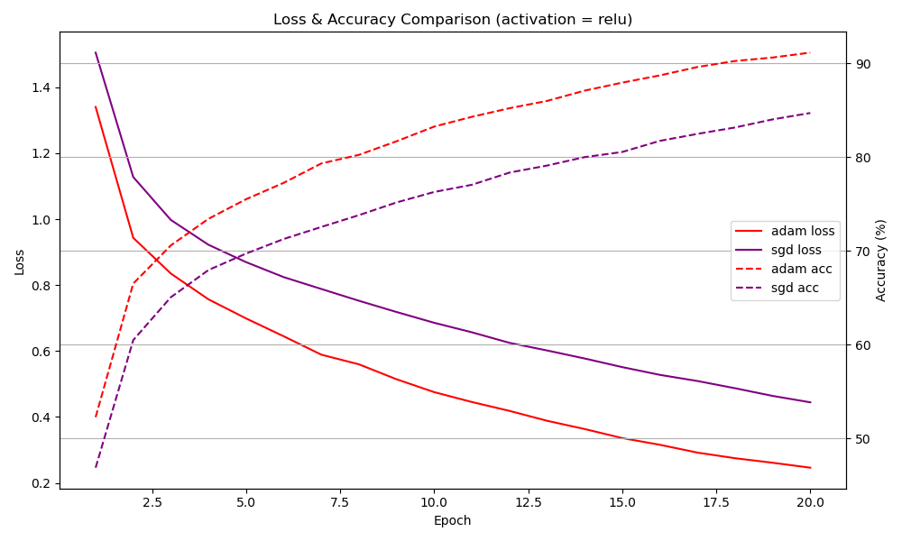
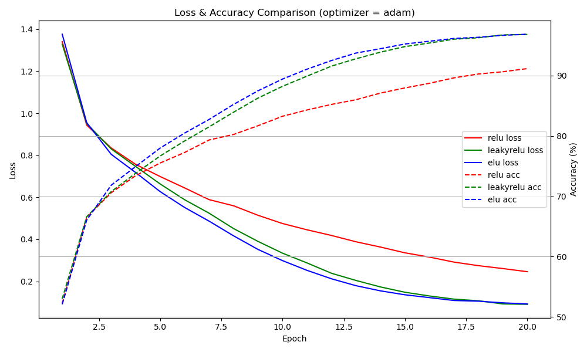
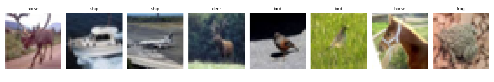

# CIFAR-10 Image Classification (Project 2 for Neural Networks and Deep Learning)

This project implements and analyzes convolutional neural networks (CNNs) trained on the CIFAR-10 dataset using PyTorch. It was completed as part of Project 2 in the Neural Network and Deep Learning course (June 2025).

---

## 📌 Project Objectives

- Build a CNN model from scratch with key components: Conv2D, Pooling, Fully Connected layers, Activations.
- Incorporate advanced modules: Batch Normalization, Dropout.
- Experiment with different optimizers (Adam, SGD) and activation functions (ReLU, LeakyReLU, ELU).
- Evaluate performance on CIFAR-10 dataset.
- Visualize training curves and predictions.
- Analyze how optimizers and activations affect training convergence.

---

## 🗂️ Project Structure

```
project/
│
├── model.py                  # ImprovedCNN model definition
├── dataset.py                # CIFAR-10 data loader
├── train.py                  # Training logic with metrics output
├── evaluate.py               # Model evaluation logic
├── main.py                   # Entry point for training + visualization
├── predict.py                # Predict and visualize sample images
├── compare.py    # Loss/accuracy comparison across activations and optimizers
└── README.md
```

---

## 🚀 How to Run

### 1. Install dependencies

Ensure you have Python 3.8+ and PyTorch. Install with:

```bash
conda install pytorch torchvision torchaudio pytorch-cuda=12.1 -c pytorch -c nvidia
```

Or using pip:

```bash
pip install torch torchvision matplotlib numpy
```

### 2. Train a model

```bash
python main.py --epochs 20 --optimizer adam --activation relu
```

### 3. Compare activation functions

```bash
python compare.py
```

### 4. Evaluate saved model

```bash
python evaluate_model.py --file cifar10_model_adam_relu.pth --activation relu
```

### 5. Visualize sample predictions

```bash
python predict.py
```

---

## 📊 Results Summary

| Setting             | Test Accuracy |
|---------------------|---------------|
| Adam + ReLU         | 77.49%        |
| Adam + LeakyReLU    | **78.82%**    |
| Adam + ELU          | 73.37%        |
| SGD  + ReLU         | 77.06%        |

---

## 🖼️ Visualizations

### ✅ Training Curve Comparison
- 
- 

### ✅ Sample Predictions
- 

---

## 🔗 Resources

- 📁 **Google Drive (Models)**  
  [Download Trained Models](https://drive.google.com/drive/folders/YOUR_DRIVE_LINK_HERE)

> Replace the above placeholders with your actual links!

---

## 📌 Author
**Your Name**  
Student ID: 2025XXXX  
Neural Networks and Deep Learning, June 2025
